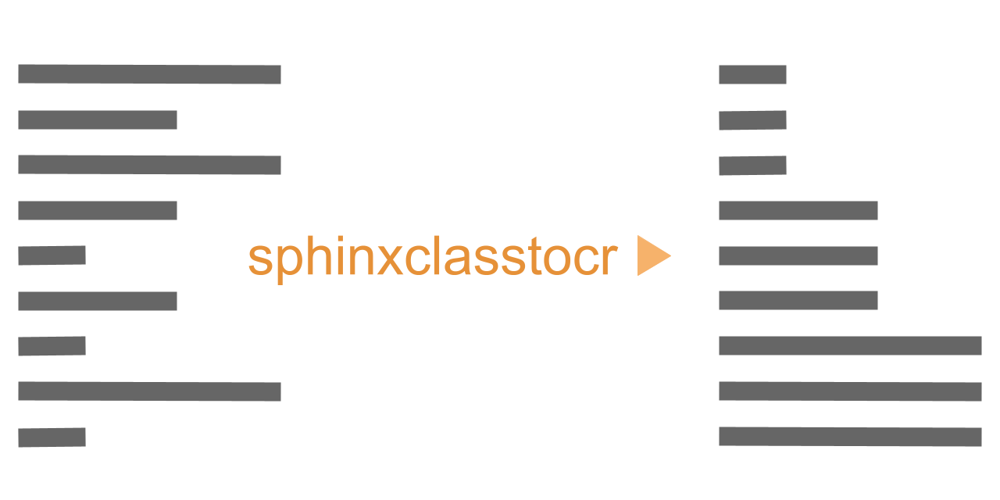

=====================
**sphinx-class-tocr**
=====================

VERSION {version}

|

|

|made-with-sphinx-doc|

.. |made-with-sphinx-doc| image:: https://img.shields.io/badge/Made%20with-Sphinx-1f425f.svg
   :target: https://www.sphinx-doc.org/

.. image:: https://coveralls.io/repos/github/imAsparky/sphinxclasstocr/badge.svg?branch=main
   :target: https://coveralls.io/github/imAsparky/sphinxclasstocr?branch=main

.. image:: https://app.codacy.com/project/badge/Grade/f4388ecc9b5a480183897378e1a840ce
   :target: https://www.codacy.com/gh/imAsparky/sphinxclasstocr/dashboard?utm_source=github.com&amp;utm_medium=referral&amp;utm_content=imAsparky/sphinxclasstocr&amp;utm_campaign=Badge_Grade
   :alt: Code Quality

.. image:: https://img.shields.io/badge/pre--commit-enabled-brightgreen?logo=pre-commit&logoColor=white
   :target: https://github.com/pre-commit/pre-commit
   :alt: pre-commit

.. image:: https://img.shields.io/badge/code%20style-black-000000.svg
   :target: https://github.com/ambv/black
   :alt: Code style: black

.. image:: https://readthedocs.org/projects/sphinxclasstocr/badge/?version=latest
   :target: https://sphinxclasstocr.readthedocs.io/en/latest/?badge=latest
   :alt: Documentation Status

|

sphinxclasstocr is a fork of this excellent project
`autoclasstoc <https://github.com/kalekundert/autoclasstoc/>`__.

*Work is in progress to modify autoclasstoc to meet the needs of our projects.*

**An installation package does not exist yet!**

Check out the CHANGELOG to see what has been done so far to
get ready.

+++++++++++++++++++++++++++++++++++++++++++++++++++++++++++++++++++++++++++++++

-----------
What is it?
-----------

A `Sphinx <https://www.sphinx-doc.org/en/master/>`__ plugin to add a TOC like
grouping capability to
`sphinx.ext.autodoc <https://www.sphinx-doc.org/en/master/usage/extensions/autodoc.html>`__.

-----------
Why use it?
-----------

To improve your user's experience, reading your projects automatically
generated API documentation, compared to using
`sphinx.ext.autodoc <https://www.sphinx-doc.org/en/master/usage/extensions/autodoc.html>`__
alone.

--------------
How does it?
--------------

sphinx-class-tocr provides a new Restructured Text directive that gives you the
flexibility to include or exclude class members, depending on the specific
needs of your project.

To help your end-user, you can

#. Include every method of a class.

#. Organise what you want to include into sections.

#. Create *sections* or use the defaults included for a quick setup.

#. Collapse inherited methods to improve readability.

It works well with `sphinx.ext.autodoc <https://www.sphinx-doc.org/en/master/usage/extensions/autodoc.html>`__
and `sphinx-autogen <https://www.sphinx-doc.org/en/master/man/sphinx-autogen.html>`__.

---------------
When to use it?
---------------

sphinx-class-tocr can be incorporated into any new or existing project.

See the `documentation`__ for more information, how to's and examples.

__ https://sphinxclasstocr.readthedocs.io/en/latest/index.html

.. image:: https://api.codacy.com/project/badge/Grade/5fd017190b9e4a6ca9381474c0342ef6
   :alt: Codacy Badge
   :target: https://app.codacy.com/gh/imAsparky/sphinxclasstocr?utm_source=github.com&utm_medium=referral&utm_content=imAsparky/sphinxclasstocr&utm_campaign=Badge_Grade_Settings
